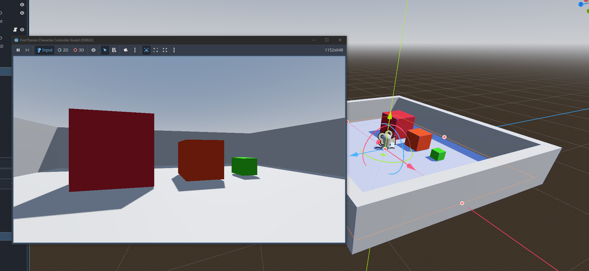

# First person character controller Godot

A first person camera and player controller system in Godot.

## Features

- Camera control with clamping for vertical direction.
- Head bobbing.
- FOV change based on movement speed (with clamping).
- Limited horizontal movement while falling.
- Jump control.
- Sprinting.

## Screenshot

